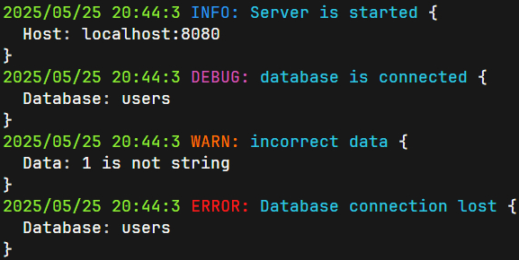

# Logger is a library for beautiful output to the terminal!



## Installation

```shell
go get github.com/Pythonchic/logger
```

## Getting Started

For simple logging, import the global logger package **github.com/Pythonchic/logger**
```go
package main

import (
    "github.com/Pythonchic/logger"
)

func main() {
    log := logger.NewLogger()
    log.Info("Server is started", logger.Arg("Host", "localhost:8080"))
}

// Output
// 2025/05/25 20:54:56 INFO: Server is started {
//   Host: localhost:8080
// }
```
